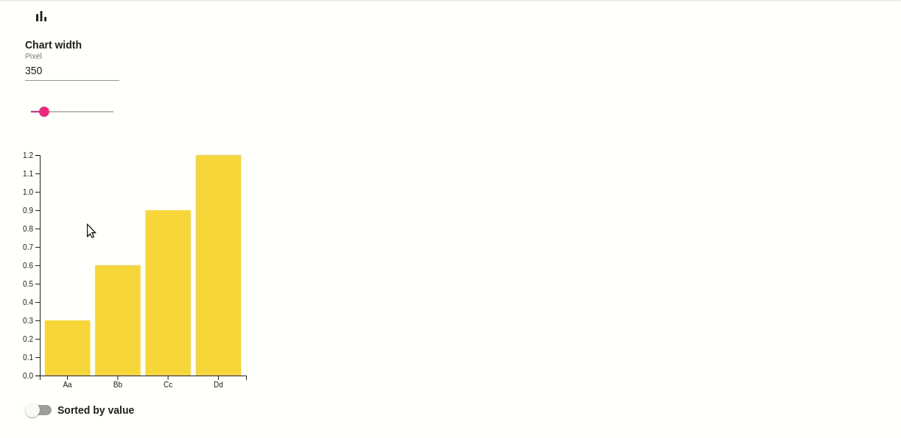
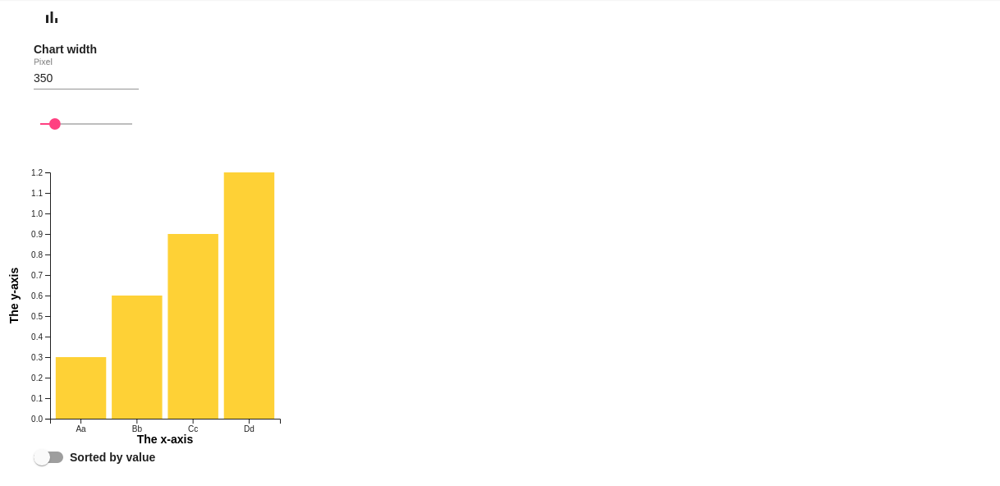
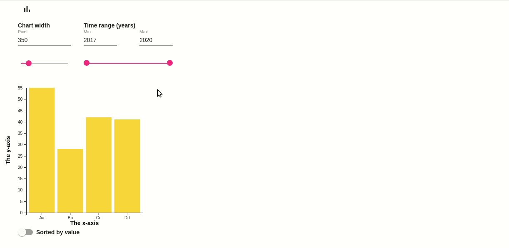

# Bar Chart
The Bar Chart app renders a bar chart based on JSON data input.

## Features
- Fixed y-axis to scroll along the x-axis of wide charts without losing the y-axis information
- Tooltip indicating each bar's exact value
- Manual setting of chart width
- Manual setting of x-axis order by bar values (descending) or labels (alphabetical)
- Optional labelling of x- and/or y-axis through JSON data input
- Optional range feature through JSON data input

### JSON Data Input

#### Necessary Input
In its basic form the Bar Chart app works with a JSON data input as follows: 

```js
"data": {
  "data": [
    {
      "label": "Aa",
      "value": 0.3
    },
    {
      "label": "Bb",
      "value": 0.6
    },
    {
      "label": "Cc",
      "value": 0.9
    },
    {
      "label": "Dd",
      "value": 1.2
    }
  ]
}
```


#### Optional Input

##### Axis Labels
You can label the x- and/or y-axis of the chart by providing some metadata: 

```js
"data": {
  "metadata": { // Indicate metadata
    "axes": {
      "x": "The x-axis", // x-axis label
      "y": "The y-axis" // y-axis label
    }
  },
  "data": [
    {
      "label": "Aa",
      "value": 0.3
    },
    {
      "label": "Bb",
      "value": 0.6
    },
    {
      "label": "Cc",
      "value": 0.9
    },
    {
      "label": "Dd",
      "value": 1.2
    }
  ]
}
```


##### Range Feature
You can invoke the bar chart range feature by indicating according data for each bar. You can optionally set a label for the range feature in the metadata section.

Initially, the "value" key for each bar should hold the total value across all range points of this bar. 

The Bar Chart app will look for the minimal and maximal value across the ranges of all bars and will display them accordingly. If a user changes the displayed range, the app will iterate through the data to re-calculate the total value for each bar's "value" key and the chart will be re-drawn. 

```js
"data": {
  "metadata": {
    "axes": {
      "x": "The x-axis",
      "y": "The y-axis"
    },
    "rangeLabel": "Time range (years)" // Range label
  },
  "data": [
    {
      "label": "Aa",
      "value": 55, // Initially, this should be the total of the values in the range below
      "range": [ // Array of unique points in a given range
        {
          "point": 2017, // Point in the range
          "value": 10 // Value at this point
        },
        {
          "point": 2018,
          "value": 15
        },
        {
          "point": 2019,
          "value": 22
        },
        {
          "point": 2020,
          "value": 8
        }
      ]
    },
    {
      "label": "Bb",
      "value": 28,
      "range": [
        {
          "point": 2017,
          "value": 7
        },
        {
          "point": 2018,
          "value": 8
        },
        {
          "point": 2019,
          "value": 13
        },
        {
          "point": 2020,
          "value": 0
        }
      ]
    },
    {
      "label": "Cc",
      "value": 42,
      "range": [
        {
          "point": 2017,
          "value": 9
        },
        {
          "point": 2018,
          "value": 14
        },
        {
          "point": 2019,
          "value": 14
        },
        {
          "point": 2020,
          "value": 5
        }
      ]
    },
    {
      "label": "Dd",
      "value": 41,
      "range": [
        {
          "point": 2017,
          "value": 8
        },
        {
          "point": 2018,
          "value": 22
        },
        {
          "point": 2019,
          "value": 5
        },
        {
          "point": 2020,
          "value": 6
        }
      ]
    }
  ]
}
```


### Chart Width

#### Initial Width
The default chart width is 350 px and the bars get distributed evenly across this width. 

However, there's an initial minimal bar width factor of 25. If the number_of_bars * 25 is greater than the default width of 350 px, the chart will be displayed with an according initial width of number_of_bars * 25 px. 

#### Manual Width Setting
You can use the input field or the width slider to manually change the current chart width. The input field always displays the current total width of the chart in pixels and the width slider is always set to the current total chart width.

##### Input Field
If you change the value of the input field, the chart width will be adapted accordingly and the width slider will be set to the new width. 

##### Slider
The slider moves in steps of 50 px. If you move the slider, the chart width will be adapted accordingly and the input field will be set to the new width. 

The slider's minimal value will always remain 150 px. The maximal value is always the current_value * 4. This means every time you move the slider all to the right, the chart width quadruples.  

### Bar Order
Initially, the x-axis is sorted by bar label. 

If you toggle the slider below the chart, the bars get sorted by value (descending). 

You can always sort back to the initial state by toggling the slider again. 
