## HTML Viewer

The HTML viewer app displays HTML text from any backend source and offers dynamic styling depending on query parameters in the URL.
This means that through another app that changes the query parameter `style`, the HTML viewer will update the layout.

### Opening the HTML viewer

On an inseri page, the HTLM viewer can be opened through the lighthouse menu, in the tab "Visualise" and clicking on "HTML Viewer".

### Configuration

The HTML viewer has one necessary input field called `htmlContent` which expects a valid HTML snippet.

In principle this HTML snippet can be requested from any server that can communicate with inseri through HTTP but for this
example we will use the JSON storage behind inseri.

For this, we enter the data management through the menu of the HTML viewer. 

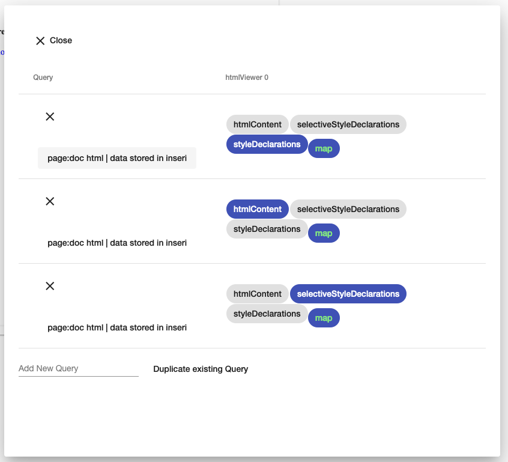

**Example for the datamanagement with the queries already defined**

We define a new query through the field "Add New Query" with a name we will recognise later. By clicking this name,
the configuration view for this query opens. 

Because we want to use the database of inseri for our HTML snippet, we have to change the dropdown with "GET" to 
"Create your own JSON object in inseri". This will open a code editor where we can insert and save our data:

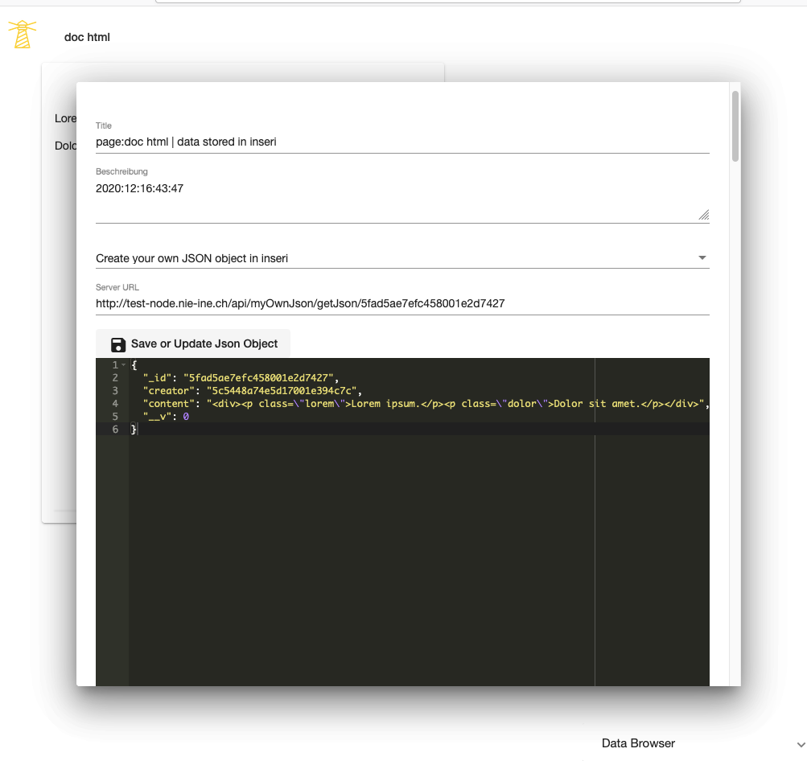

After this, the content has to be mapped to the right input field of our app.
In the data management next to our query, select the chip `htmlContent` and press "map" to open the mapping view.

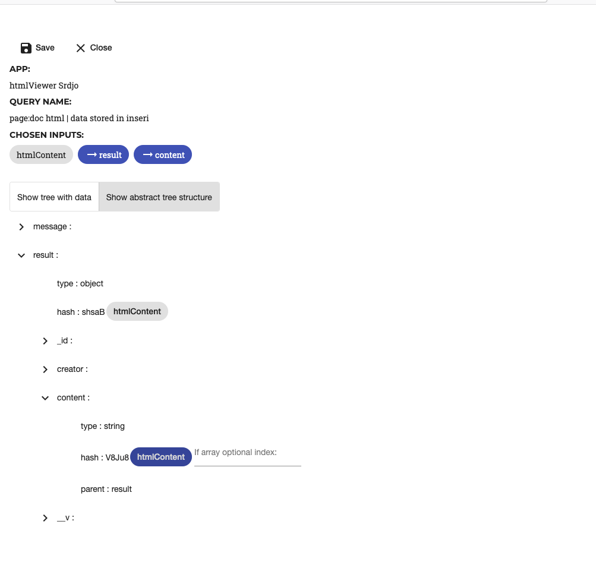

You can explore the query response and if you are sure, you can enter the structure view and map the input field to 
the right data field. As we put our HTML snippet in `content`, our path has to reach that field.

After saving and closing the configurations, the app should show the content.

### Optional parameters

#### Default markup

The input field `styleEnvironments` is comparable to linking the HTML document to a simple CSS file, both in its 
functionality and in its form. Input to this field is optional and in case of its absence the default styles of
inseri and the user's browser are applied.

The most used way for this input is a JSON object saved in inseri like the example for the HTML content above.

Instead of the CSS notation a dot for classes and plain for selectors, a `type` field with the options `class` or `tag` makes
the distinction and the `name` field contains the string. The other fields are normal key-value paris as in CSS:

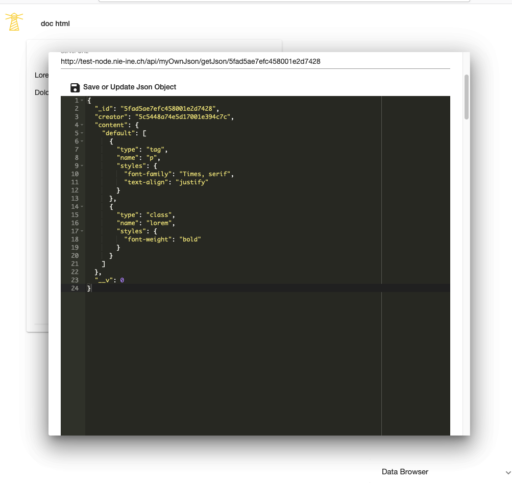

For the mapping, the whole object including the field `default` has to be mapped to the input:

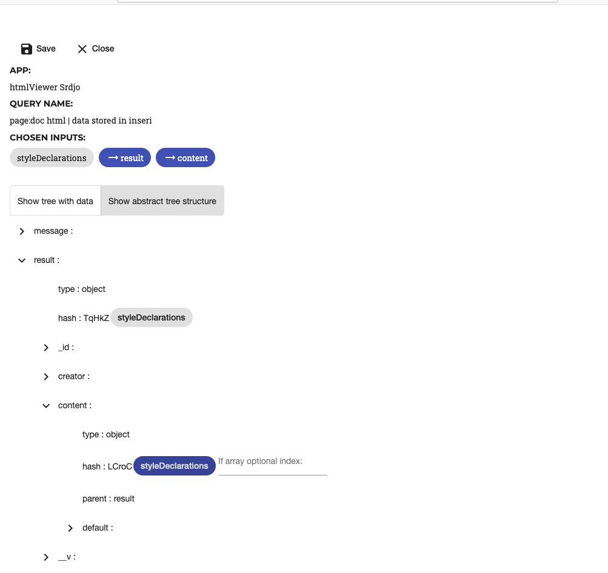

The app will then be updated to the new configuration:

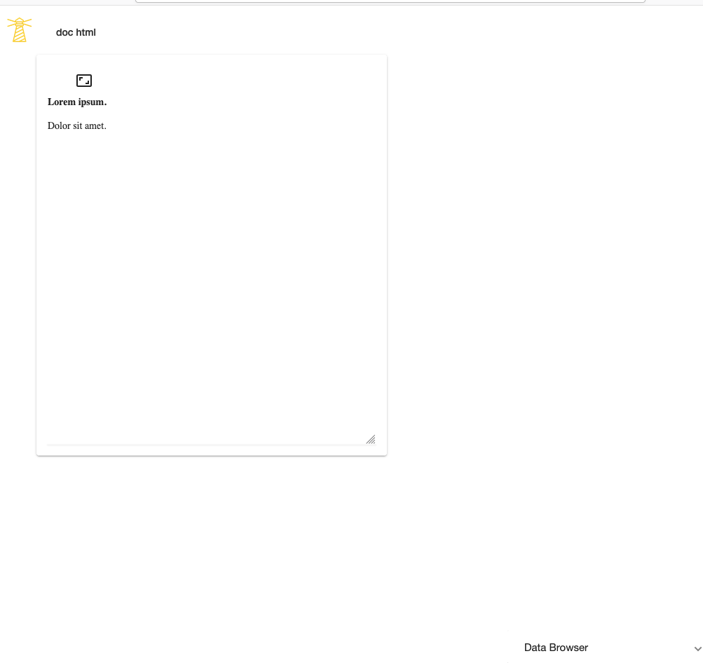

#### Dynamic markup

Next to the configurable but static input, there is a field for markup that changes depending on the query parameter `style`.
It works best in combination with another app that sets this parameter and it can share this `style` parameter with
other apps that have their own markup for each value.

This input field is optional and in case of its absence, changes in the `style` parameter have no effect.

The input field `selectiveStyleEnvironments` follows the same form as `styleEnvironments` except there will usually be more
fields like `default`:

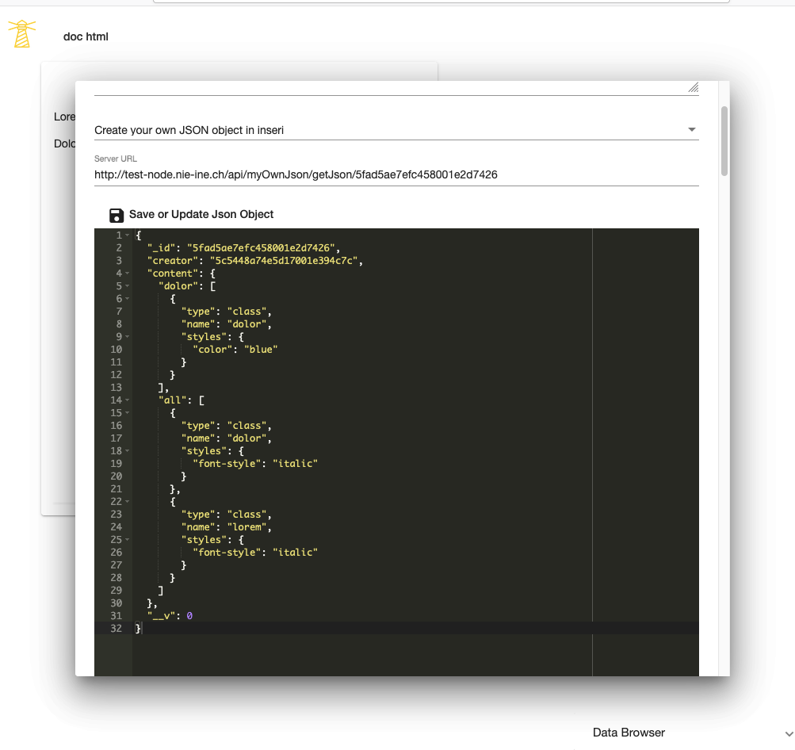

The mapping is similar to above:

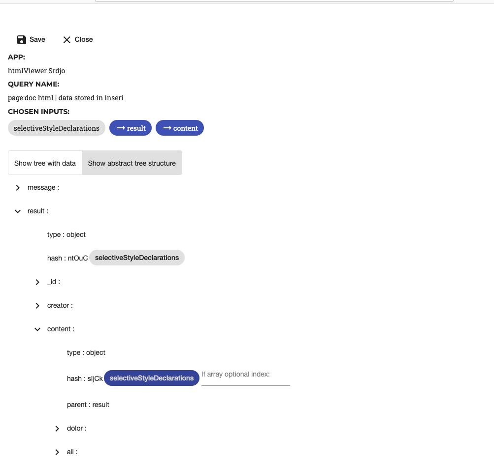

Setting one of the included parameter values into the URL will change the app:

`style` is set to `dolor`:

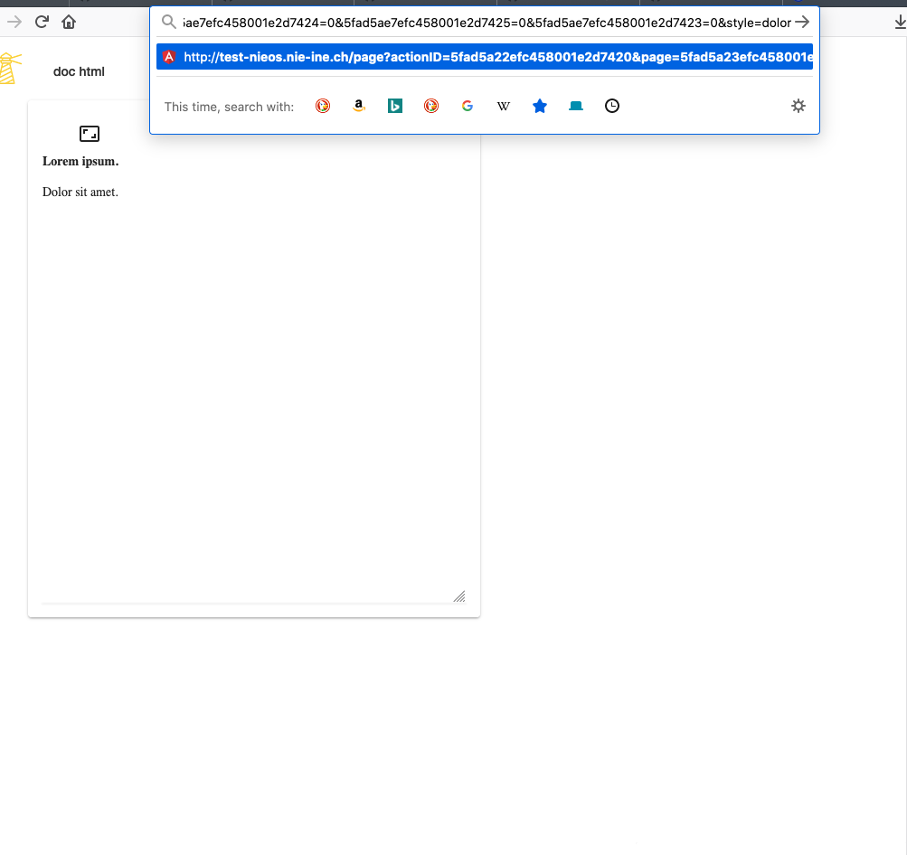

Styles for `dolor` are applied:

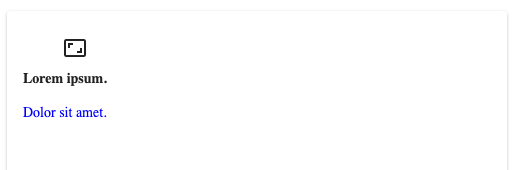

Or `style` is set to `all`:

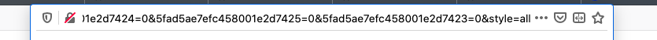

Styles for `all` are applied:

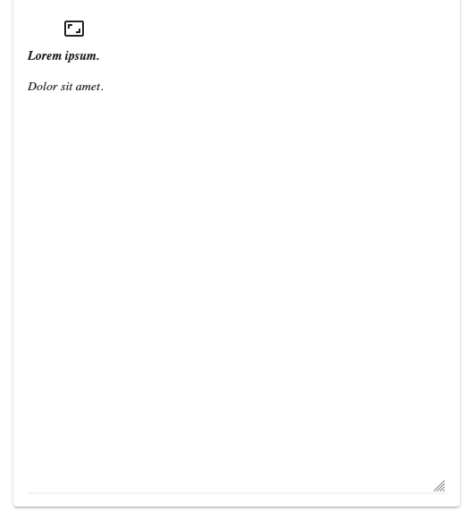
