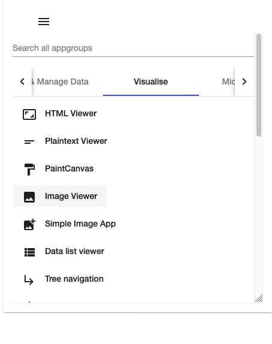
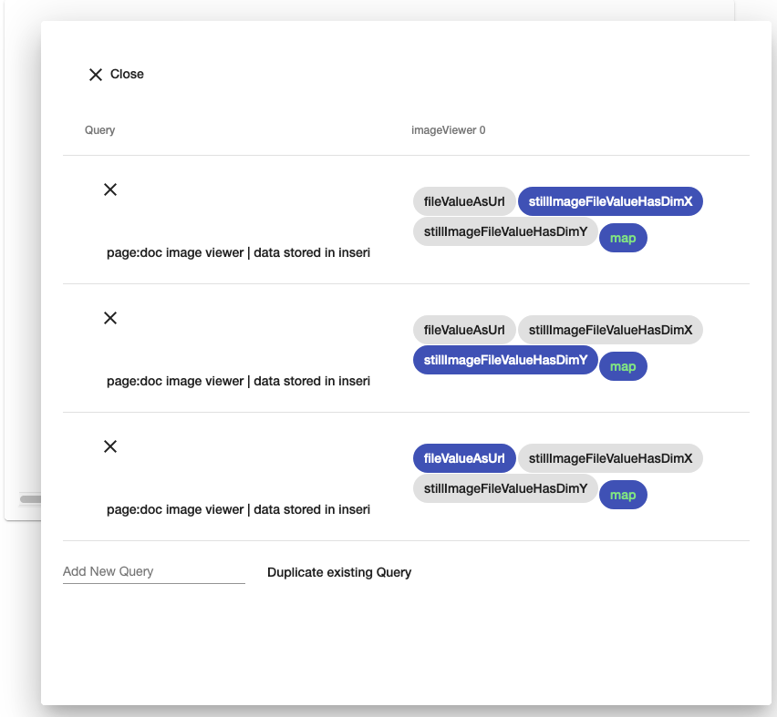
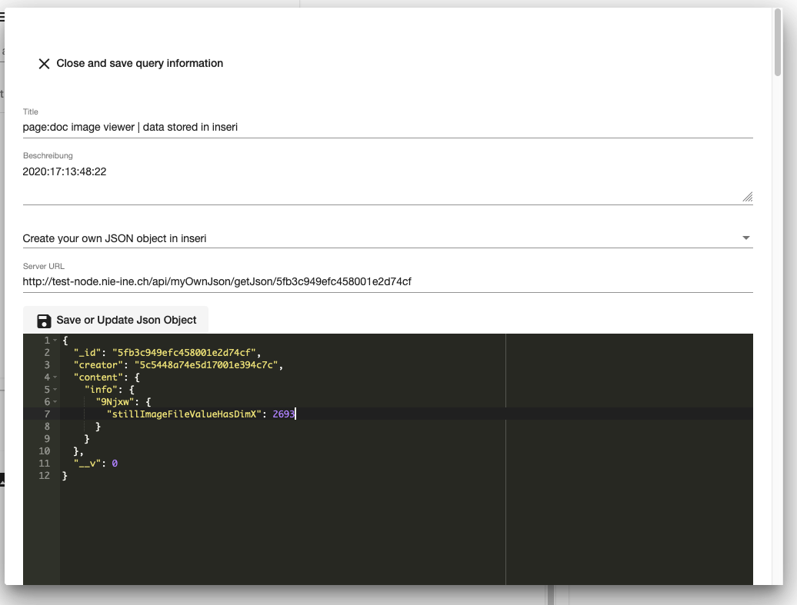
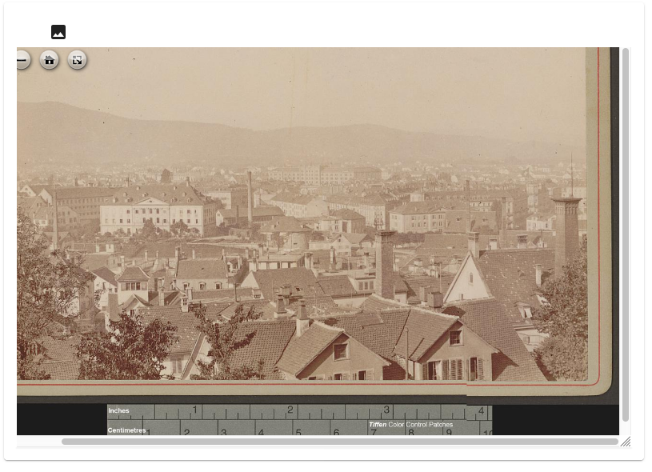

## Image Viewer

The Image Viewer app makes it possible to view images supporting the [IIIF](https://iiif.io/) protocol in inseri. 

It is based on the open source IIIF viewer [OpenSeadragon](https://openseadragon.github.io/)
 ([GitHub](https://github.com/openseadragon)).

The app is supposed to support SVG overlays in the future by using the plugin
[SVG-Overlay](https://github.com/openseadragon/svg-overlay), also by OpenSeadragon.

### Inputs

This app needs three fields as input values: The URL to a IIIF picture, its maximal width and its maximal height, 
i.e. the resolution on the server. This information can be taken from the IIIF manifest.

For this documentation, we will take a [picture from e-manuscripta](https://www.e-manuscripta.ch/zuzneb/content/titleinfo/1206565) 
with the following parameters:

- Image URL: `fileValueAsUrl` with value `https://www.e-manuscripta.ch/zuzneb/i3f/v21/1206566` (without the information 
about a specific resolution or image quality)
- Maximal width: `stillImageFileValueHasDimX` with value 2693
- Maximal height: `stillImageFileValueHasDimY` with value 2231

### Adding the viewer to a page

The Image Viewer can be added to a page through the menu (lighthouse), "Visualise", "Image Viewer":

### Configuration

Through the Image Viewer menu, select "Data Management", which should open the following view:

There, press the first button `page:<project name | data stored in inseri` to open the following view and update the value to your image:

Save/update the JSON and close the view.

Repeat this for the other two input fields.

The Image Viewer should now show the image, where you can zoom deeper:

