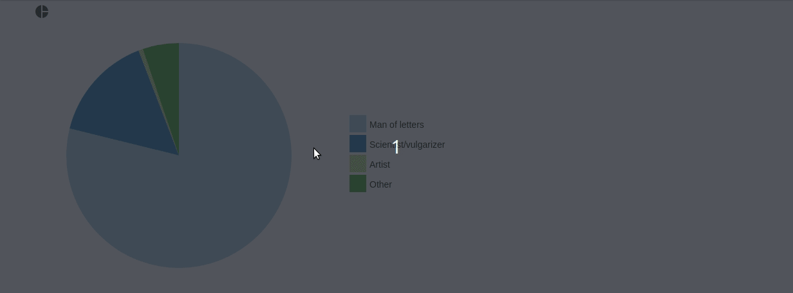
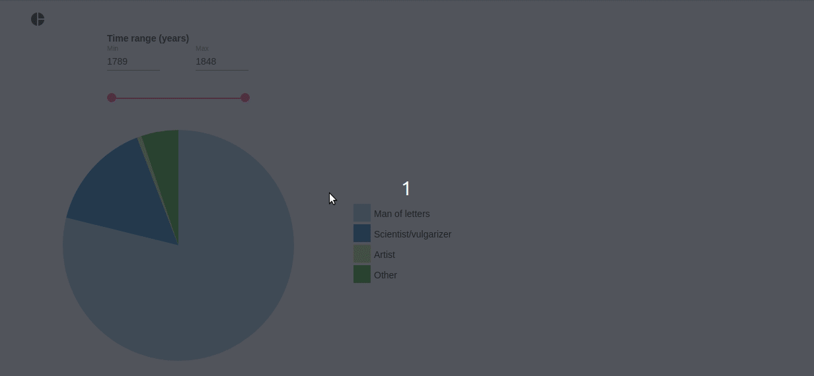

# Pie Chart V2
The Pie Chart V2 app renders a pie chart and chart legend based on JSON data input.

## Features
- Tooltip indicating each pie piece's label and value
- Optional range feature through JSON data input

### JSON Data Input

#### Necessary Input
In its basic form the Pie Chart V2 app works with a JSON data input as follows: 

```js
"data": {
  "data": [
    {
      "label": "Man of letters",
      "value": 4451
    },
    {
      "label": "Scientist/vulgarizer",
      "value": 865
    },
    {
      "label": "Artist",
      "value": 36
    },
    {
      "label": "Other",
      "value": 293
    }
  ]
}
```


#### Optional Input

##### Range Feature
You can invoke the pie chart range feature by indicating according data for each bar. You can optionally set a label for the range feature in the metadata section. If not set, the range label will default to just "Range".

Initially, the "value" key for each pie piece should hold the total value across all range points of this piece. 

The Pie Chart V2 app will look for the minimal and maximal value across the ranges of all bars and will display them accordingly. If a user changes the displayed range, the app will iterate through the data to re-calculate the total value for each bar's "value" key and the chart will be re-drawn. 

```js
"data": {
  "metadata": { // Optionally indicate a label for the given range
    "rangeLabel": "Time range (years)"
  },
  "data": [
    {
      "label": "Man of letters",
      "value": 4451,
      "range": [
        {
          "point": 1789,
          "value": 3000
        },
        {
          "point": 1804,
          "value": 500
        },
        {
          "point": 1826,
          "value": 600
        },
        {
          "point": 1848,
          "value": 351
        }
      ]
    },
    {
      "label": "Scientist/vulgarizer",
      "value": 865,
      "range": [
        {
          "point": 1789,
          "value": 100
        },
        {
          "point": 1804,
          "value": 200
        },
        {
          "point": 1826,
          "value": 500
        },
        {
          "point": 1848,
          "value": 65
        }
      ]
    },
    {
      "label": "Artist",
      "value": 36,
      "range": [
        {
          "point": 1789,
          "value": 0
        },
        {
          "point": 1804,
          "value": 0
        },
        {
          "point": 1826,
          "value": 36
        },
        {
          "point": 1848,
          "value": 0
        }
      ]
    },
    {
      "label": "Other",
      "value": 293,
      "range": [
        {
          "point": 1789,
          "value": 50
        },
        {
          "point": 1804,
          "value": 93
        },
        {
          "point": 1826,
          "value": 70
        },
        {
          "point": 1848,
          "value": 80
        }
      ]
    }
  ]
}
```

