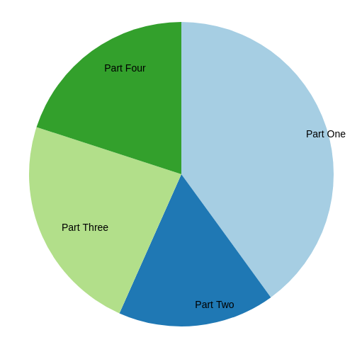

# Pie Chart
The Pie Chart app renders a basic pie chart with labelled pie pieces based on JSON data input.

## JSON Data Input

The Pie Chart app works with a JSON data input as follows: 

```js
"data": {
  "data": [
    {
      "label": "Part One",
      "value": 12
    },
    {
      "label": "Part Two",
      "value": 5
    },
    {
      "label": "Part Three",
      "value": 7
    },
    {
      "label": "Part Four",
      "value": 6
    }
  ]
}
```


