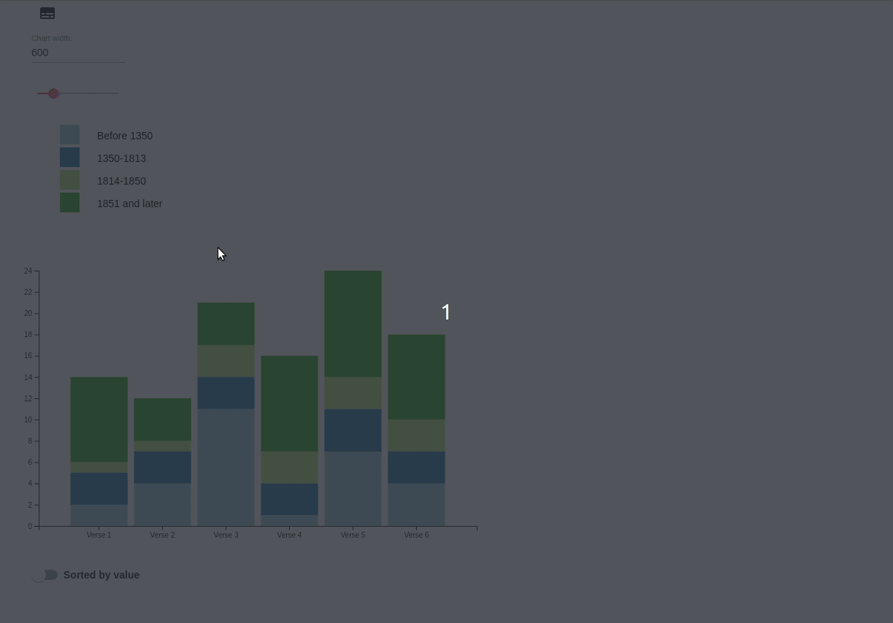
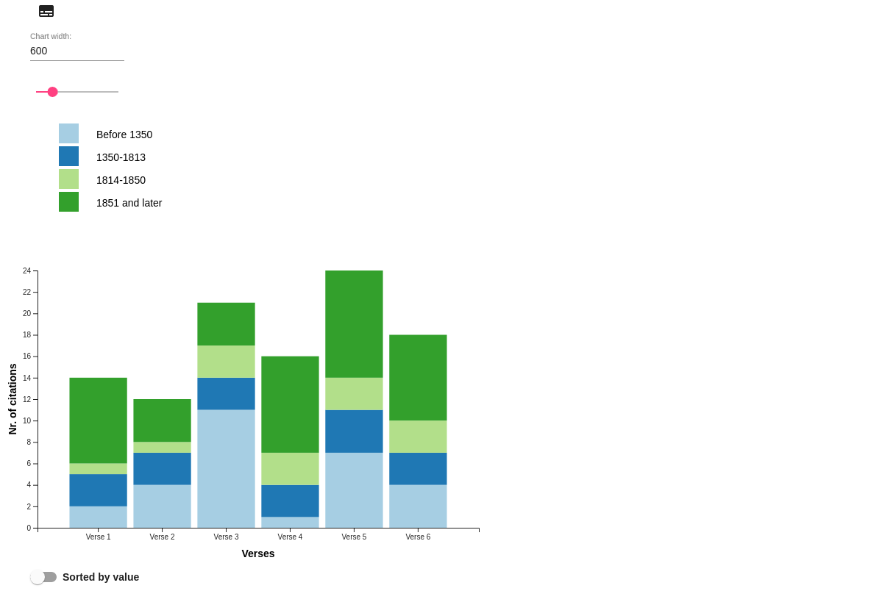

# Stacked Bar Chart
The Stacked Bar Chart app renders a stacked bar chart based on JSON data input.

## Features
- Fixed y-axis to scroll along the x-axis of wide charts without losing the y-axis information
- Tooltip indicating each stack's exact value
- Manual setting of chart width
- Manual setting of x-axis order by bar values (descending) or labels (alphabetical)
- Manual toggling of groups to show or hide
- Optional labelling of x- and/or y-axis through JSON data input

### JSON Data Input

#### Necessary Input
In its basic form the Stacked Bar Chart app works with a JSON data input as follows: 

```js
"data": {
  "data": [
	{
	  "label": "Verse 1",
	  "Before 1350": 2,
	  "1350-1813": 3,
	  "1814-1850": 1,
	  "1851 and later": 8
	},
	{
	  "label": "Verse 2",
	  "Before 1350": 4,
	  "1350-1813": 3,
	  "1814-1850": 1,
	  "1851 and later": 4
	},
	{
	  "label": "Verse 3",
	  "Before 1350": 11,
	  "1350-1813": 3,
	  "1814-1850": 3,
	  "1851 and later": 4
	},
	{
	  "label": "Verse 4",
	  "Before 1350": 1,
	  "1350-1813": 3,
	  "1814-1850": 3,
	  "1851 and later": 9
	},
	{
	  "label": "Verse 5",
	  "Before 1350": 7,
	  "1350-1813": 4,
	  "1814-1850": 3,
	  "1851 and later": 10
	},
	{
	  "label": "Verse 6",
	  "Before 1350": 4,
	  "1350-1813": 3,
	  "1814-1850": 3,
	  "1851 and later": 8
	}
  ]
}
```


#### Optional Input

##### Axis Labels
You can label the x- and/or y-axis of the chart by providing some metadata: 

```js
"data": {
  "metadata": { // Indicate metadata
    "axes": {
      "x": "Verses", // x-axis label
      "y": "Nr. of citations" // y-axis label
    }
  },
  "data": [
	{
	  "label": "Verse 1",
	  "Before 1350": 2,
	  "1350-1813": 3,
	  "1814-1850": 1,
	  "1851 and later": 8
	},
	{
	  "label": "Verse 2",
	  "Before 1350": 4,
	  "1350-1813": 3,
	  "1814-1850": 1,
	  "1851 and later": 4
	},
	{
	  "label": "Verse 3",
	  "Before 1350": 11,
	  "1350-1813": 3,
	  "1814-1850": 3,
	  "1851 and later": 4
	},
	{
	  "label": "Verse 4",
	  "Before 1350": 1,
	  "1350-1813": 3,
	  "1814-1850": 3,
	  "1851 and later": 9
	},
	{
	  "label": "Verse 5",
	  "Before 1350": 7,
	  "1350-1813": 4,
	  "1814-1850": 3,
	  "1851 and later": 10
	},
	{
	  "label": "Verse 6",
	  "Before 1350": 4,
	  "1350-1813": 3,
	  "1814-1850": 3,
	  "1851 and later": 8
	}
  ]
}
```


### Chart Width

#### Initial Width
The default chart width is calculated as the number of stacked bars on the x-axis times 100 px. The stacked bars get distributed evenly across this width. 

#### Manual Width Setting
You can use the input field or the width slider to manually change the current chart width. The input field always displays the current total width of the chart in pixels and the width slider is always set to the current total chart width.

##### Input Field
If you change the value of the input field, the chart width will be adapted accordingly and the width slider will be set to the new width. 

##### Slider
The slider moves in steps of 50 px. If you move the slider, the chart width will be adapted accordingly and the input field will be set to the new width. 

The slider's minimal value will always remain 150 px. The maximal value is always the current_value * 4. This means every time you move the slider all to the right, the chart width quadruples.  

### Stacked Bar Order
Initially, the x-axis is sorted by stacked bar label. 

If you toggle the slider below the chart, the stacked bars get sorted by its total value (descending). 

You can always sort back to the initial state by toggling the slider again. 
