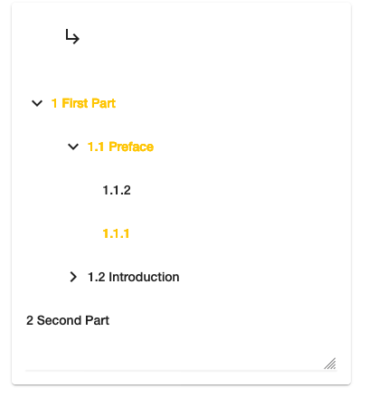

## Tree Navigation

The Tree Navigation App makes it possible to show several Knora resources that are in a hierarchy on one page.
The selected path through for example section, chapter and subchapter is represented in the URL and can easily 
be shared this way.



The typical use is a table of contents where the lower level are connected to the upper level with a property
similar to isPartOf.
All the nodes in this table of contents are clickable and the selection can be made available to other components.

This app expects special knowledge of the used ontology in Knora and the query parameters in the URL.
It does not just show data but it has the aim to enable interaction with data through different apps.

This app uses the [Angular Material Tree](https://material.angular.io/components/tree/overview) that brings in 
predefined behaviours as the toggling of subtrees.

### Configuration

The default input for `queryResponse` is a JSON tree with Knora-flavoured JSON-LD with the depending resources located in a list of
lists.

```json
{
    "@graph" : [ {
      "@id" : "http://rdfh.ch/0041/07GyRR1fQLSjaIlAjRTq_Q",
      "knora-api:hasIncomingLinkValue" : [ {
        "@id" : "http://rdfh.ch/0041/CEdPhqFoRqa4JMrLokpwHw/values/UggSvRfhQ2eCYrdD56TTJg",
        "knora-api:linkValueHasSource" : {
          "@id" : "http://rdfh.ch/0041/CEdPhqFoRqa4JMrLokpwHw",
          "knora-api:hasIncomingLinkValue" : [ {
            "@id" : "http://rdfh.ch/0041/Gm5PgeLGSRigeey7qQdLPQ/values/fSsQheDbQjW884yWYzbwAg",
            "knora-api:linkValueHasSource" : {
              "@id" : "http://rdfh.ch/0041/Gm5PgeLGSRigeey7qQdLPQ",
              "rdf-any:isPartOfValue" : {
                "@id" : "http://rdfh.ch/0041/Gm5PgeLGSRigeey7qQdLPQ/values/fSsQheDbQjW884yWYzbwAg",
                "knora-api:linkValueHasTargetIri" : {
                  "@id" : "http://rdfh.ch/0041/CEdPhqFoRqa4JMrLokpwHw"
                }
              },
              "rdfs:label" : "1.1.2"
            }
          }, {
            "@id" : "http://rdfh.ch/0041/WA9dphq9RpmXkq5nSo6q3Q/values/hCPW4zkMQ1qzP-dm9H4OJg",
            "knora-api:linkValueHasSource" : {
              "@id" : "http://rdfh.ch/0041/WA9dphq9RpmXkq5nSo6q3Q",
              "rdf-any:isPartOfValue" : {
                "@id" : "http://rdfh.ch/0041/WA9dphq9RpmXkq5nSo6q3Q/values/hCPW4zkMQ1qzP-dm9H4OJg",
                "knora-api:linkValueHasTargetIri" : {
                  "@id" : "http://rdfh.ch/0041/CEdPhqFoRqa4JMrLokpwHw"
                }
              },
              "rdfs:label" : "1.1.1"
            }
          } ],
          "http://api.knora.org/ontology/shared/literature/v2#isPartOfVerseSongbookValue" : {
            "@id" : "http://rdfh.ch/0041/CEdPhqFoRqa4JMrLokpwHw/values/UggSvRfhQ2eCYrdD56TTJg",
            "knora-api:linkValueHasTargetIri" : {
              "@id" : "http://rdfh.ch/0041/07GyRR1fQLSjaIlAjRTq_Q"
            }
          },
          "rdfs:label" : "1.1 Preface"
        }
      }, {
        "@id" : "http://rdfh.ch/0041/wGhv_G4WRY6oFheTUKfe0g/values/4DnXHLSrTQ-GISigvqI61w",
        "knora-api:linkValueHasSource" : {
          "@id" : "http://rdfh.ch/0041/wGhv_G4WRY6oFheTUKfe0g",
          "knora-api:hasIncomingLinkValue" : [ {
            "@id" : "http://rdfh.ch/0041/DjQku61RQqSw0pb6v0wubg/values/AMLosisfT2es99L_glnEpg",
            "knora-api:linkValueHasSource" : {
              "@id" : "http://rdfh.ch/0041/DjQku61RQqSw0pb6v0wubg",
              "rdf-any:isPartOfValue" : {
                "@id" : "http://rdfh.ch/0041/DjQku61RQqSw0pb6v0wubg/values/AMLosisfT2es99L_glnEpg"
              },
              "rdfs:label" : "1.2.1"
            }
          }, {
            "@id" : "http://rdfh.ch/0041/pPyHJDIiQIm-t1GJtdd_KQ/values/BGNpnIcrTP6qEWOQjsKEUw",
            "knora-api:linkValueHasSource" : {
              "@id" : "http://rdfh.ch/0041/pPyHJDIiQIm-t1GJtdd_KQ",
              "rdf-any:isPartOfValue" : {
                "@id" : "http://rdfh.ch/0041/pPyHJDIiQIm-t1GJtdd_KQ/values/BGNpnIcrTP6qEWOQjsKEUw",
                "knora-api:linkValueHasTargetIri" : {
                  "@id" : "http://rdfh.ch/0041/wGhv_G4WRY6oFheTUKfe0g"
                }
              },
              "rdfs:label" : "1.2.2"
            }
          } ],
          "http://api.knora.org/ontology/shared/literature/v2#isPartOfVerseSongbookValue" : {
            "@id" : "http://rdfh.ch/0041/wGhv_G4WRY6oFheTUKfe0g/values/4DnXHLSrTQ-GISigvqI61w",
            "knora-api:linkValueHasTargetIri" : {
              "@id" : "http://rdfh.ch/0041/07GyRR1fQLSjaIlAjRTq_Q"
            }
          },
          "rdfs:label" : "1.2 Introduction"
        }
      } ],
      "rdfs:label" : "1 First Part"
    }, {
      "@id" : "http://rdfh.ch/0041/KJ7tU9IwSZyFL90cLp0-dQ",
      "rdfs:label" : "2 Second Part"
    } ],
    "@context" : {
      "rdf" : "http://www.w3.org/1999/02/22-rdf-syntax-ns#",
      "knora-api" : "http://api.knora.org/ontology/knora-api/v2#",
      "rdfs" : "http://www.w3.org/2000/01/rdf-schema#",
      "xsd" : "http://www.w3.org/2001/XMLSchema#"
    }
}
```

Such an input can be generated to a GravSearch query to Knora with the following content:

```sparql
PREFIX atharvaveda: <http://0.0.0.0:3333/ontology/0041/atharvaveda/simple/v2#>
PREFIX text: <http://api.knora.org/ontology/shared/text/simple/v2#>
PREFIX literature: <http://api.knora.org/ontology/shared/literature/simple/v2#>
PREFIX rdfs: <http://www.w3.org/2000/01/rdf-schema#>
PREFIX knora-api: <http://api.knora.org/ontology/knora-api/simple/v2#>

CONSTRUCT {
    ?kanda knora-api:isMainResource true .
    ?sukta literature:isPartOfVerseSongbook ?kanda .
    ?strophe atharvaveda:isStropheOfSukta ?sukta .
} WHERE {
    ?kanda a atharvaveda:Kanda .
    OPTIONAL { 
        ?sukta a atharvaveda:Sukta .
        ?sukta literature:isPartOfVerseSongbook ?kanda .
        OPTIONAL {
            ?strophe a atharvaveda:Strophe .
            ?strophe atharvaveda:isStropheOfSukta ?sukta .
        }
    }
}
```

This GravSearch query has to be sent as HTTP Post request to a Knora server at the route `/v2/searchextended`.
The domain may vary, for a local install it would usually be 
`http://localhost:3333/v2/searchextended` (with full path).

No IDs and labels have to be queried through extra statements as they are per default given back by Knora.

### Connection to other apps

For each level in a selected path in the tree, a query parameter is added to the URL.
The parameter name follows the pattern `d<number>` where `<number>` stands for the depth.
