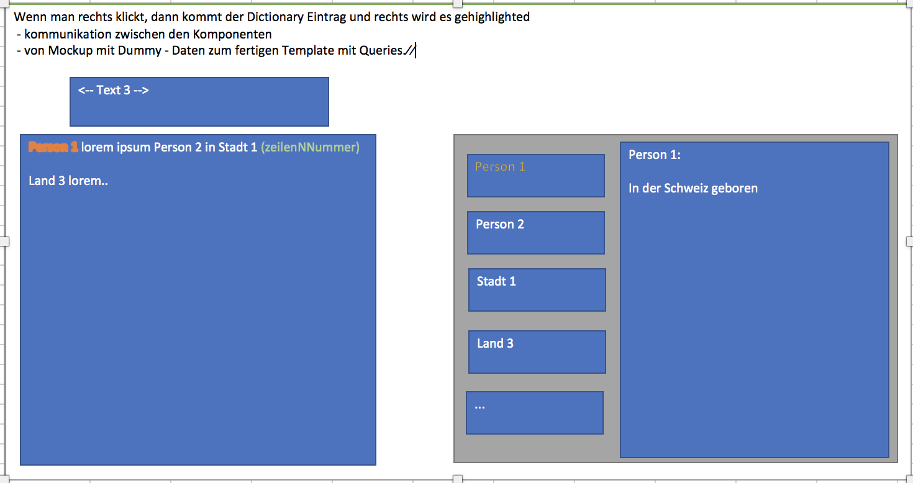

# About this part of the documentation

The folder "how-to-program-with-nie-os" is a tutorial from a mockup to a working implementation and from a working implementation to apps.

The mockup looks the following way:

It consists of 3 components:

 - navigation component --> navigate between different texts
 - text display component --> displays chosen text and line numbers
 - dictionary component --> if you choose a dictionary entry, the other component will search for this entry and highlight it. 