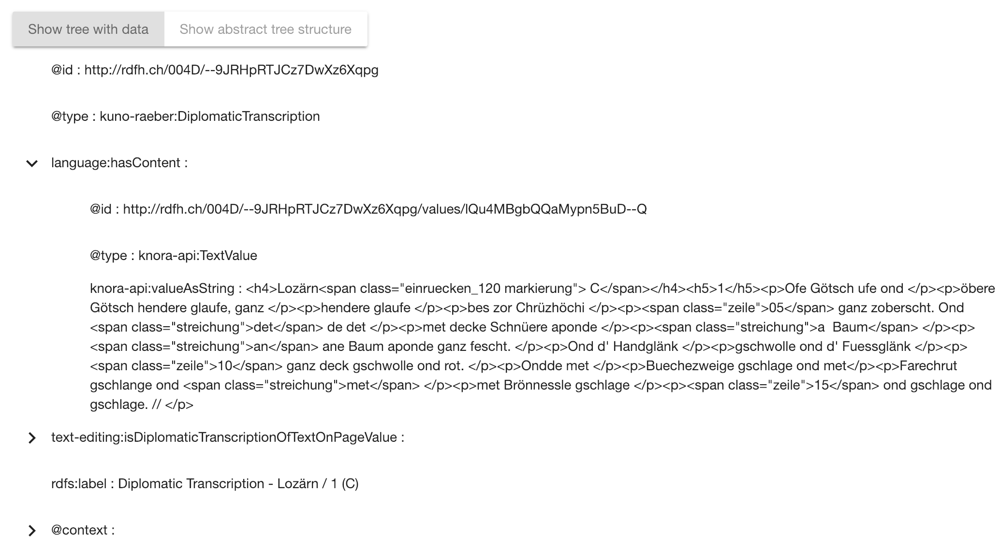
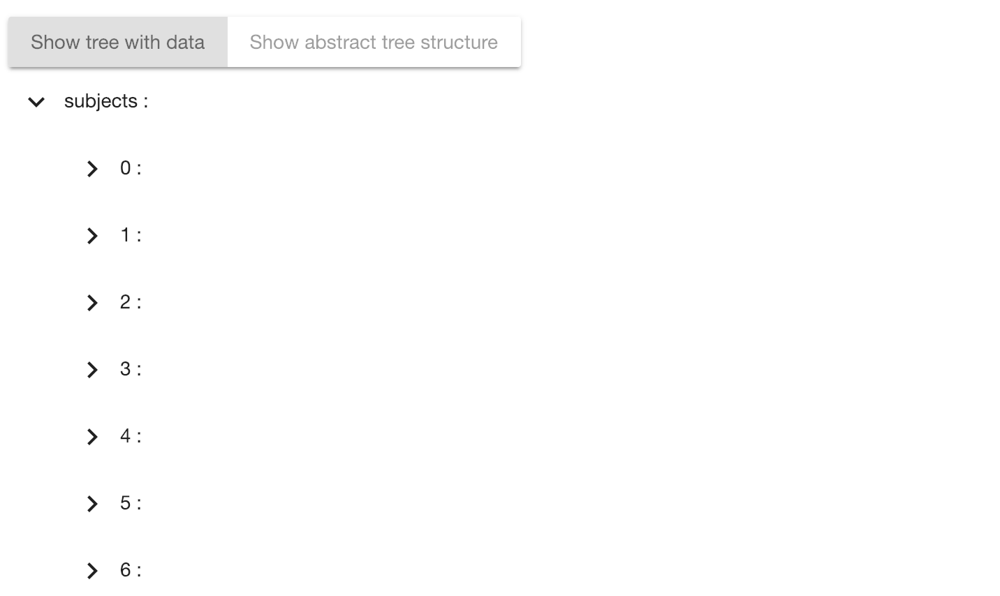
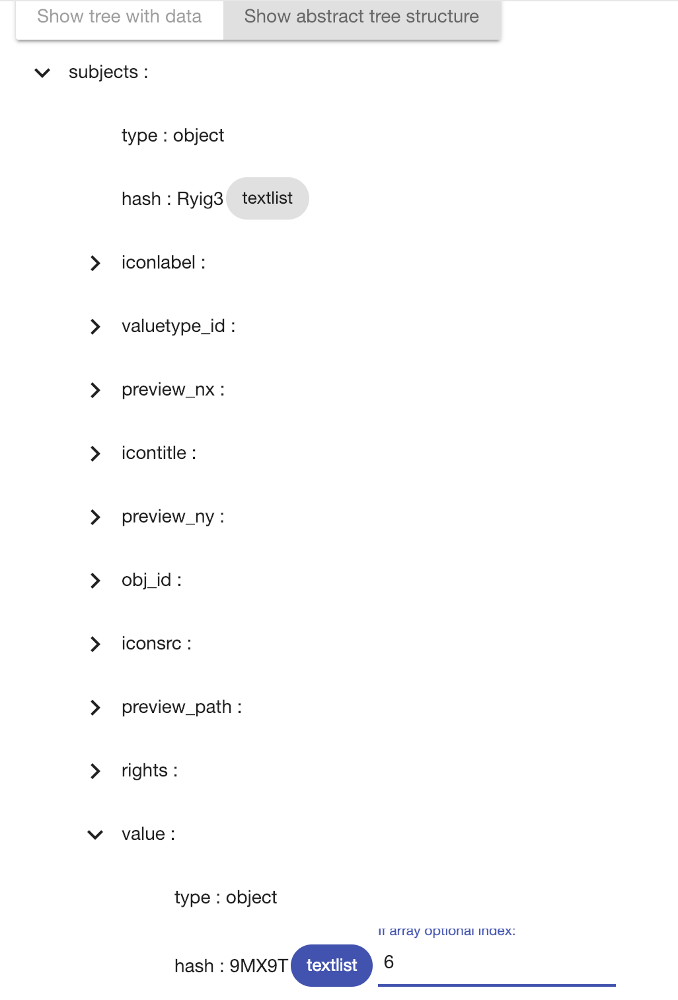

## Test Data Management through GUI

This note described how to test if the data assignment process where query responses are mapped to apps works.

### 1. No - depth mapping

A no - depth mapping is a mapping where query response data without an array is mapped to apps. Lets have a look at the following query and the according response and mapping:

Query: 

```sparql
PREFIX knora-api: <http://api.knora.org/ontology/knora-api/simple/v2#>
PREFIX kuno-raeber: <http://0.0.0.0:3333/ontology/004D/kuno-raeber/simple/v2#>
PREFIX language: <http://0.0.0.0:3333/ontology/004F/language/simple/v2#>
PREFIX text-editing: <http://0.0.0.0:3333/ontology/005A/text-editing/simple/v2#>
        
        CONSTRUCT {
        
        ?transcription knora-api:isMainResource true .
        ?transcription language:hasContent ?content .
        ?transcription text-editing:isDiplomaticTranscriptionOfTextOnPage ?page .
        ?page knora-api:hasStillImageFileValue ?image
        
        } WHERE {
        
        BIND(<http://rdfh.ch/004D/--9JRHpRTJCz7DwXz6Xqpg> AS ?transcription)
        ?transcription language:hasContent ?content .
        ?transcription text-editing:isDiplomaticTranscriptionOfTextOnPage ?page .
        ?page knora-api:hasStillImageFileValue ?image
            
        } OFFSET 0

```

Response and mapping, the response shows that there is no array within the data to be displayed




This data should be able to be displayed within an app.

### 2. Single dimension depth mapping:

```
http://130.60.24.65:3338/v1/search/?searchtype=extended&filter_by_restype=http%3A%2F%2Fwww.knora.org%2Fontology%2Fkuno-raeber-gui%23Poem&property_id=http%3A%2F%2Fwww.knora.org%2Fontology%2Fkuno-raeber-gui%23hasConvoluteIRI&compop=EQ&searchval=http%3A%2F%2Frdfh.ch%2Fkuno-raeber%2FUzo2YDhzTr-8CUSg1pQL4Q&property_id=http%3A%2F%2Fwww.knora.org%2Fontology%2Fkuno-raeber-gui%23hasPoemTitle&compop=!EQ&searchval=123455666&property_id=http%3A%2F%2Fwww.knora.org%2Fontology%2Fkuno-raeber-gui%23hasPoemCreationDate&compop=!EQ&searchval=GREGORIAN%3A2217-01-27&property_id=http%3A%2F%2Fwww.knora.org%2Fontology%2Fkuno-raeber-gui%23hasPoemText&compop=!EQ&searchval=123455666&property_id=http%3A%2F%2Fwww.knora.org%2Fontology%2Fkuno-raeber-gui%23hasPoemIRI&compop=!EQ&searchval=123455666&property_id=http%3A%2F%2Fwww.knora.org%2Fontology%2Fkuno-raeber-gui%23hasConvoluteIRI&compop=!EQ&searchval=123455666&property_id=http%3A%2F%2Fwww.knora.org%2Fontology%2Fkuno-raeber-gui%23hasConvoluteTitle&compop=!EQ&searchval=123455666&property_id=http%3A%2F%2Fwww.knora.org%2Fontology%2Fknora-base%23seqnum&compop=!EQ&searchval=123455666&property_id=http%3A%2F%2Fwww.knora.org%2Fontology%2Fkuno-raeber-gui%23hasDateIndex&compop=!EQ&searchval=123455666&property_id=http%3A%2F%2Fwww.knora.org%2Fontology%2Fkuno-raeber-gui%23hasAlphabeticIndex&compop=!EQ&searchval=123455666&property_id=http%3A%2F%2Fwww.knora.org%2Fontology%2Fkuno-raeber-gui%23hasSynopsisTitle&compop=!EQ&searchval=123455666&property_id=http%3A%2F%2Fwww.knora.org%2Fontology%2Fkuno-raeber-gui%23hasSynopsisIRI&compop=!EQ&searchval=123455666&property_id=http%3A%2F%2Fwww.knora.org%2Fontology%2Fkuno-raeber-gui%23isFinalVersion&compop=!EQ&searchval=123455666&property_id=http%3A%2F%2Fwww.knora.org%2Fontology%2Fkuno-raeber-gui%23isOnPage&compop=!EQ&searchval=123455666&show_nrows=2000
```

The response clearly shows that there is an array in the depth = 1



### 3. Multi dimensional mapping

Query:

```
PREFIX knora-api: <http://api.knora.org/ontology/knora-api/simple/v2#>
PREFIX kuno-raeber: <http://0.0.0.0:3333/ontology/004D/kuno-raeber/simple/v2#>
PREFIX language: <http://0.0.0.0:3333/ontology/004F/language/simple/v2#>
PREFIX text-editing: <http://0.0.0.0:3333/ontology/005A/text-editing/simple/v2#>
        
        CONSTRUCT {
        
        ?transcription knora-api:isMainResource true .
        ?transcription language:hasContent ?content .
        ?transcription text-editing:isDiplomaticTranscriptionOfTextOnPage ?page .
        ?page knora-api:hasStillImageFileValue ?image
        
        } WHERE {
        
        BIND(<http://rdfh.ch/004D/--9JRHpRTJCz7DwXz6Xqpg> AS ?transcription)
        ?transcription language:hasContent ?content .
        ?transcription text-editing:isDiplomaticTranscriptionOfTextOnPage ?page .
        ?page knora-api:hasStillImageFileValue ?image
            
        } OFFSET 0

```
This is the same query from the first example, but the mapping refers to an array

