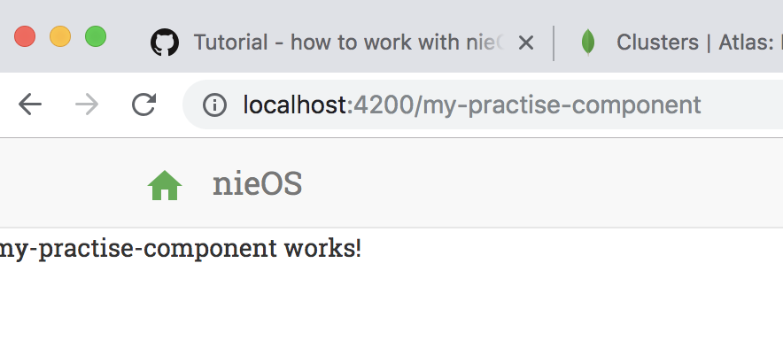

# Defining the mockup data

## Generating the component and module for this tutorial
At first, generate the component and the module for this tutorial and link it to the route "my-practise-component"

```ng g m how-to-program-with-nie-os```

so, in the folder how-to-program-with-nie-os module

```ng g c my-practise-component```

and add the route to the module you just generated

```
    RouterModule.forRoot([
      {path: 'my-practise-component', component: MyPractiseComponentComponent}
    ])
```


Import the module you created to core.module.ts so that it is found by Angular.

To the html - template, add the style margin-top: 30px so that you see the content of the html part of the component.

You should see sth like the following:

